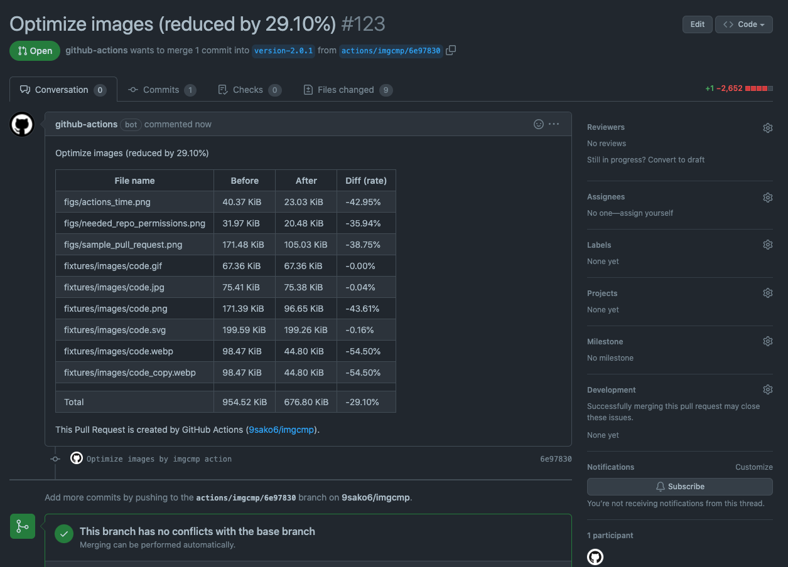

<h1 align="center">imgcmp</h1>

<p align="center"></p>

<p align="center">
  <a href="https://goreportcard.com/report/github.com/9sako6/imgcmp">
    
  </a>
  <a href="https://github.com/9sako6/imgcmp/actions?imgcmp-test">
    
  </a>
</p>

This [GitHub action](https://github.com/features/actions) optimizes images in your repository.
You will receive a pull request with optimized images after your pull request.
This Github action is inspired by [ImgBot](https://github.com/dabutvin/ImgBot).

The pull request example:

<p align="center"></p>

## Usage

To use the GitHub acion add the following lines to your `.github/workflows/imgcmp.yml`:

```yml
name: imgcmp
on: pull_request
jobs:
  build:
    name: imgcmp
    runs-on: ubuntu-latest
    steps:
      - uses: 9sako6/imgcmp@master
        env:
          GITHUB_TOKEN: ${{ secrets.GITHUB_TOKEN }}
```

Then, you will receive a pull request with optimized images after your pull request.

## Configuration

imgcmp offers an ignore option.

example:

```yml
name: imgcmp
on: pull_request
jobs:
  build:
    name: imgcmp
    runs-on: ubuntu-latest
    steps:
      - uses: 9sako6/imgcmp@master
        env:
          GITHUB_TOKEN: ${{ secrets.GITHUB_TOKEN }}
          IGNORED_FILES: "public/*:posts/*.svg"
```

## Supported image formats

- [x] JPEG/JPG
- [x] PNG
- [x] GIF
- [x] SVG
- [x] WEBP

## Optimization tools

This bot uses these optimizers.

### [jpegoptim](https://github.com/tjko/jpegoptim)

- `-m85`: this will store the image with 85% quality

### [OptiPNG](http://optipng.sourceforge.net/)

- `-o2`: this sets the optimization level 2 (there is 0-7 optimization levels)

### [Gifsicle](https://www.lcdf.org/gifsicle/)

- `-O3`: this sets the optimization level to Gifsicle's maximum

### [SVGO](https://github.com/svg/svgo)

SVGO's default configuration will be used.

### [cwebp](https://developers.google.com/speed/webp/docs/cwebp)

- `-q 75`: cwebp's default optimization level

## Author

9sako6
