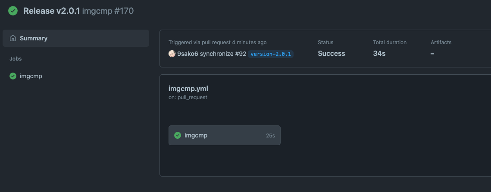

<h1 align="center">imgcmp</h1>

<p align="center"></p>

<p align="center">
  <a href="https://github.com/9sako6/imgcmp/actions?CI">
    
  </a>
  <a href="https://github.com/marketplace/actions/imgcmp">
    
  </a>
</p>

This GitHub Actions optimizes images in your repository.
You will receive a pull request with optimized images.
This Github Actions is inspired by [ImgBot](https://github.com/dabutvin/ImgBot).

A pull request example:

<p align="center"></p>

## Usage

### 1st Step

You need to create a [Personal access token](https://docs.github.com/en/authentication/keeping-your-account-and-data-secure/creating-a-personal-access-token) with those permission to open a pull request automatically.


Then please add the personal access token to your [repository secrets](https://docs.github.com/en/actions/security-guides/encrypted-secrets#creating-encrypted-secrets-for-a-repository) with an easily recognizable name. For example, `IMGCMP_ACCESS_TOKEN`.

### 2nd step

To run this GitHub Actions, please add the following lines to your `.github/workflows/imgcmp.yml`:

```yml
name: imgcmp
on: push
jobs:
  imgcmp:
    if: ${{ startsWith(github.head_ref, 'actions/imgcmp/') != true }}
    runs-on: ubuntu-latest
    steps:
      - uses: 9sako6/imgcmp@v2.0.0
        with:
          token: ${{ secrets.IMGCMP_ACCESS_TOKEN }}
```

If you want to run this action only once a week, please add the following lines.

```yml
name: imgcmp
on:
  schedule:
    - cron: "0 0 * * 1" # Weekly build
jobs:
  imgcmp:
    if: ${{ startsWith(github.head_ref, 'actions/imgcmp/') != true }}
    runs-on: ubuntu-latest
    steps:
      - uses: 9sako6/imgcmp@v2.0.0
        with:
          token: ${{ secrets.IMGCMP_ACCESS_TOKEN }}
```

Then, you will receive a pull request with optimized images every Monday at 0:00.

## Configuration

### `paths-ignore-regexp`

imgcmp offers an ignore option.
`paths-ignore-regexp` is regular expression for images' paths you don't want to compress.

Example:

```yml
name: imgcmp
on: push
jobs:
  imgcmp:
    if: ${{ startsWith(github.head_ref, 'actions/imgcmp/') != true }}
    runs-on: ubuntu-latest
    steps:
      - uses: 9sako6/imgcmp@v2.0.0
        with:
          token: ${{ secrets.IMGCMP_ACCESS_TOKEN }}
          paths-ignore-regexp: "(ignore/.*)|(public/.*)"
```

## Supported image formats

- [x] JPEG/JPG
- [x] PNG
- [x] GIF
- [x] SVG
- [x] WEBP

## Optimization tools

This bot uses these optimizers.

### [jpegoptim](https://github.com/tjko/jpegoptim)

- `-m85`: this will store the image with 85% quality

### [OptiPNG](http://optipng.sourceforge.net/)

- `-o2`: this sets the optimization level 2 (there is 0-7 optimization levels)

### [Gifsicle](https://www.lcdf.org/gifsicle/)

- `-O3`: this sets the optimization level to Gifsicle's maximum

### [SVGO](https://github.com/svg/svgo)

SVGO's default configuration will be used.

### [cwebp](https://developers.google.com/speed/webp/docs/cwebp)

- `-q 75`: cwebp's default optimization level

## Benchmark

It took 28 sec to create the following PR.

<p align="center"></p>

<p align="center"></p>

## Change Log

### `v2.0.0` (February 6, 2022)

There are breaking changes from version `1.0.1`.

- Use a Personal access token instead of `GITHUB_TOKEN` (https://github.com/9sako6/imgcmp/pull/26)
  - `GITHUB_TOKEN` didn't have enough authority.
- Add `token` input (https://github.com/9sako6/imgcmp/pull/26)
  - `GITHUB_TOKEN` option in `env` was deleted.
- Add `paths-ignore-regexp` input (https://github.com/9sako6/imgcmp/pull/26)
  - `IGNORED_FILES` option in `env` was deleted.
- Refactoring the pull request template (https://github.com/9sako6/imgcmp/pull/26)

## Author

9sako6
