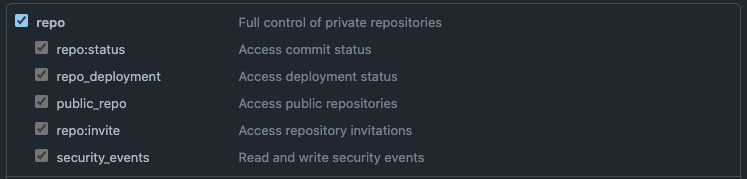
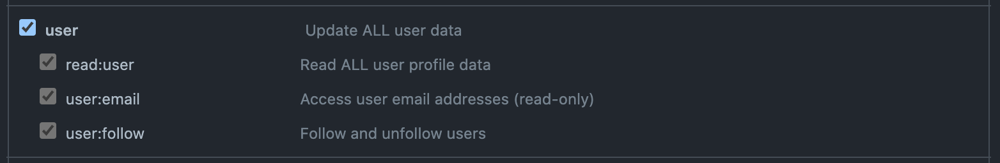

# How to use a Personal Access Token

## Settings

### 1st Step

You need to create a
[Personal access token](https://docs.github.com/en/authentication/keeping-your-account-and-data-secure/creating-a-personal-access-token)
with those permission to open a pull request automatically.




Then please add the personal access token to your
[repository secrets](https://docs.github.com/en/actions/security-guides/encrypted-secrets#creating-encrypted-secrets-for-a-repository)
with an easily recognizable name. For example, `IMGCMP_ACCESS_TOKEN`.

### 2nd step

To run this GitHub Actions, please add the following lines to your
`.github/workflows/imgcmp.yml`:

```yml
name: imgcmp
on:
  push:
    branches:
      - main
      - master
jobs:
  imgcmp:
    runs-on: ubuntu-latest
    steps:
      - uses: 9sako6/imgcmp@v2.0.2
        with:
          token: ${{ secrets.IMGCMP_ACCESS_TOKEN }}
```
